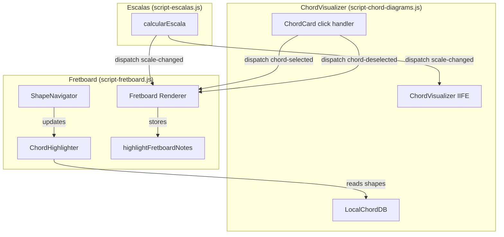

# Design Document: Chord Fretboard Visualization

## Overview

Esta feature conecta o grid de diagramas de acorde (`ChordVisualizer`) ao componente de fretboard (`script-fretboard.js`), permitindo que o usuário clique em um card de acorde e visualize as posições correspondentes diretamente no braço do instrumento. A navegação entre shapes alternativos acontece via botões (◀ ▶) renderizados junto ao fretboard, e a restauração do destaque de escala é automática ao receber novo evento `scale-changed` ou ao clicar novamente no card ativo.

A comunicação segue o padrão event-driven já estabelecido no projeto: um novo `CustomEvent('chord-selected')` é emitido pelo `ChordVisualizer` e consumido pelo fretboard. Um evento complementar `chord-deselected` permite toggle de volta ao destaque de escala.

## Architecture



### Decisões Arquiteturais

1. **Evento como contrato**: `chord-selected` carrega `{ chordName, root, shapes }` — toda a informação necessária para o fretboard operar independentemente, sem acoplar aos internos do ChordVisualizer.

2. **HighlightMode exclusivo**: O fretboard mantém um estado interno `_highlightMode` (`'scale'` | `'chord'`) que determina qual tipo de destaque está ativo. Os dois modos são mutuamente exclusivos.

3. **ShapeNavigator no fretboard**: Os botões de navegação entre shapes do acorde ficam no container do fretboard (não no chord card), pois a representação visual é no braço. Isso separa a navegação de voicings no card (diagrama SVG) da navegação de shapes no fretboard.

4. **Armazenamento de estado de escala**: O fretboard já armazena `_lastScaleState` para re-aplicar destaque após rebuild. Essa mesma referência é usada para restaurar o destaque de escala quando o modo chord é desativado.

5. **Sem build step**: Todo código segue IIFE pattern com `var` e funções globais, compatível com carga direta via `<script defer>`.

## Components and Interfaces

### ChordHighlighter (novo sub-módulo em script-fretboard.js)

```javascript
/**
 * Aplica destaque de acorde no fretboard baseado em um ChordShape.
 * Remove destaques anteriores (escala ou acorde) antes de aplicar.
 *
 * @param {ChordShape} shape - Shape ativo a destacar
 * @param {string} rootNote - Nota raiz do acorde (ex: "A", "C#")
 * @param {number} numStrings - Número de cordas do instrumento ativo
 */
function highlightChordOnFretboard(shape, rootNote, numStrings)

/**
 * Remove todo destaque de acorde do fretboard.
 * Não restaura destaque de escala (responsabilidade do caller).
 */
function clearChordHighlight()

/**
 * Mapeia um ChordShape para um array de posições absolutas no fretboard.
 * Função pura — não acessa DOM.
 *
 * @param {ChordShape} shape - O shape a mapear
 * @param {number} numStrings - Número de cordas
 * @returns {{ stringIndex: number, fret: number, isRoot: boolean }[]}
 *   Array de posições (string data-index + fret number), excluindo muted (-1)
 */
function mapShapeToPositions(shape, numStrings)
```

### ShapeNavigator (novo componente DOM no fretboard)

```javascript
/**
 * Cria ou atualiza o componente de navegação de shapes no container do fretboard.
 *
 * @param {ChordShape[]} shapes - Array de shapes disponíveis
 * @param {Function} onNavigate - Callback chamado com o novo shape index
 * @returns {{ destroy: Function, update: Function }}
 */
function createFretboardShapeNavigator(shapes, onNavigate)
```

### Evento chord-selected (dispatch no ChordVisualizer)

```javascript
/**
 * Dispatched quando usuário clica em um ChordCard com shapes disponíveis.
 *
 * @event chord-selected
 * @type {CustomEvent}
 * @property {Object} detail
 * @property {string} detail.chordName - Nome completo do acorde (ex: "Am7")
 * @property {string} detail.root - Nota raiz (ex: "A")
 * @property {ChordShape[]} detail.shapes - Array com todos os shapes disponíveis
 */
document.dispatchEvent(new CustomEvent('chord-selected', { detail: { chordName, root, shapes } }));
```

### Evento chord-deselected (dispatch no ChordVisualizer)

```javascript
/**
 * Dispatched quando usuário clica no ChordCard já ativo (toggle off).
 *
 * @event chord-deselected
 * @type {CustomEvent}
 */
document.dispatchEvent(new CustomEvent('chord-deselected'));
```

### Modificações no ChordVisualizer (script-chord-diagrams.js)

```javascript
/**
 * Handler de click no ChordCard — adicionado ao render().
 * Verifica se o card já está ativo (toggle) e se há shapes disponíveis.
 *
 * @param {ChordInfo} chord - Dados do acorde clicado
 * @param {HTMLElement} cardElement - Elemento DOM do card
 */
function handleChordCardClick(chord, cardElement)
```

## Data Models

### ChordHighlightState (estado interno do fretboard)

```javascript
{
  mode: 'scale' | 'chord',       // Modo de destaque ativo
  activeChordName: string | null, // Nome do acorde ativo (null se mode='scale')
  activeShapes: ChordShape[],     // Array de shapes do acorde ativo
  activeShapeIndex: number,       // Índice do shape atualmente exibido
  rootNote: string | null         // Nota raiz do acorde ativo
}
```

### Posição mapeada (saída de mapShapeToPositions)

```javascript
{
  stringIndex: number,  // Índice da corda no array de tuning (data index)
  fret: number,         // Número do fret (absoluto, 0-24)
  isRoot: boolean       // Se esta posição corresponde à nota raiz
}
```

### Evento chord-selected detail

```javascript
{
  chordName: string,     // Ex: "Am7", "C#maj7"
  root: string,          // Ex: "A", "C#"
  shapes: ChordShape[]   // 1+ shapes do LocalChordDB
}
```

## Correctness Properties

*A property is a characteristic or behavior that should hold true across all valid executions of a system — essentially, a formal statement about what the system should do. Properties serve as the bridge between human-readable specifications and machine-verifiable correctness guarantees.*

### Property 1: Event detail structure completeness

*For any* chord name present in LocalChordDB, when a `chord-selected` event is dispatched for that chord, the event detail SHALL contain a non-empty `chordName` string, a non-empty `root` string extracted from the chord name, and a `shapes` array identical to `LocalChordDB.getChordShapes(chordName)`.

**Validates: Requirements 1.2**

### Property 2: Chord highlighting matches shape positions exactly

*For any* valid ChordShape and root note, the set of fretboard cells highlighted with `in-chord` class SHALL correspond exactly to the non-muted (fret ≠ -1) positions of the shape mapped to absolute fret numbers, and cells at root note positions SHALL additionally have the `chord-root` class. No cells outside the shape's fret range or on muted strings SHALL be highlighted.

**Validates: Requirements 2.2, 2.3, 2.4, 2.5, 2.6**

### Property 3: Cyclic shape navigation

*For any* total number of shapes N ≥ 2 and any sequence of `next()` and `prev()` operations, the navigator index SHALL wrap cyclically within [0, N-1]. Specifically: after K consecutive `next()` calls from index 0, the index SHALL be K % N; after K consecutive `prev()` calls from index 0, the index SHALL be (N - K % N) % N.

**Validates: Requirements 3.3, 3.4**

### Property 4: Position indicator format

*For any* navigator with total T shapes and current index I (0 ≤ I < T), `getIndicator()` SHALL return the string `(I+1) + "/" + T`.

**Validates: Requirements 3.5**

### Property 5: Mutual exclusion of active chord card

*For any* sequence of chord card selections, at most one ChordCard SHALL have the `chord-card-active` CSS class at any given time. After a deselection event, zero ChordCards SHALL have the class.

**Validates: Requirements 5.1, 5.2, 5.3**

## Error Handling

| Cenário | Tratamento |
|---------|-----------|
| `chord-selected` com shapes array vazio | Não deveria ocorrer (req 1.3 previne), mas se recebido: ignora evento, mantém estado atual. |
| `chord-selected` com shape.frets.length ≠ numStrings | Usa `Math.min(shape.frets.length, numStrings)` para iterar, ignora posições excedentes. |
| Fretboard não inicializado quando evento chega | Listener só é registrado após `initializeFretboard()`. Evento antes disso é ignorado naturalmente. |
| Shape com startFret > número de frets do instrumento | Destaca apenas frets dentro do range válido do instrumento, ignora frets fora. |
| Navegação de shapes com array de 1 elemento | ShapeNavigator não é criado (req 3.2). Se chamado programaticamente, next/prev retorna index 0. |
| ChordCard click durante transição de escala | Evento `chord-selected` sobrescreve qualquer estado pendente — last-write-wins. |
| LocalChordDB retorna shapes com dados incompletos | `mapShapeToPositions` trata `undefined` como 0 (open string), evitando crash. |

## Testing Strategy

### Abordagem Dual

- **Property-based tests** (fast-check + vitest): Validam propriedades universais das funções puras.
- **Unit tests** (vitest + jsdom): Validam interações DOM específicas e edge cases.

### Property-Based Tests

Biblioteca: **fast-check** (já instalada)
Runtime: **vitest** com ambiente **jsdom**
Mínimo: **100 iterações** por property test

Cada property test taggeado com:
```
Feature: chord-fretboard-visualization, Property {N}: {description}
```

**Funções puras testáveis por PBT:**
1. `mapShapeToPositions(shape, numStrings)` → Property 2
2. `createVoicingNavigator(total).next()/.prev()` → Property 3
3. `createVoicingNavigator(total).getIndicator()` → Property 4
4. Event detail construction logic → Property 1
5. Active card selection state management → Property 5

### Unit Tests (Exemplos e Edge Cases)

- Chord card click com shapes disponíveis dispara `chord-selected` (req 1.1)
- Chord card sem shapes no LocalChordDB não dispara evento (req 1.3)
- Click no botão de navegação do card não propaga (req 1.4, stopPropagation)
- Receber `chord-selected` remove classes `in-scale`/`tonic` (req 2.1)
- ShapeNavigator aparece com 2+ shapes, some com 1 shape (req 3.1, 3.2)
- `scale-changed` restaura destaque de escala e esconde navigator (req 4.1, 4.2)
- Click no card ativo despacha `chord-deselected` (req 4.3)
- ChordCards são focáveis via teclado com Enter/Space (req 6.1, 6.2)
- Botões do navigator possuem `aria-label` (req 6.4)

### Estrutura de Arquivos de Teste

```
tests/cases/chord-fretboard-visualization/
├── shape-positions.property.spec.js          (Property 2)
├── cyclic-navigation.property.spec.js        (Properties 3, 4)
├── event-detail.property.spec.js             (Property 1)
├── active-card-exclusion.property.spec.js    (Property 5)
├── chord-highlight.unit.spec.js              (DOM integration examples)
└── chord-selection.unit.spec.js              (event dispatch, keyboard, a11y)
```
