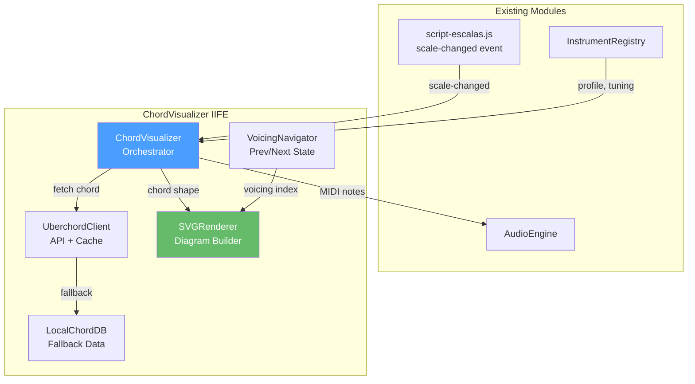
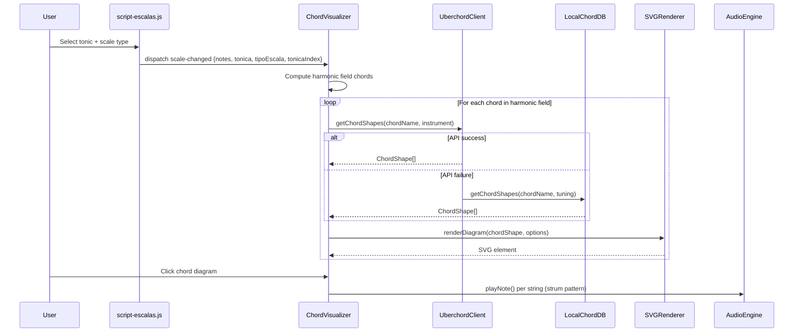

# Design Document: Chord Visualizer

## Overview

The Chord Visualizer module (`ChordVisualizer`) renders SVG chord diagrams for the harmonic field of the currently selected scale in MusicPages. It listens to the existing `scale-changed` CustomEvent, computes the harmonic field chords, fetches voicings from the Uberchord API (with local fallback), and renders inline SVG diagrams that adapt to the active instrument profile. Users can navigate between voicings and trigger audio playback via the existing AudioEngine.

The module follows the project's IIFE pattern, lives in a single file (`scripts/script-chord-diagrams.js`), and exposes `window.ChordVisualizer` with a conditional `module.exports` for Vitest testing.

## Architecture



### Event Flow



## Components and Interfaces

### 1. ChordVisualizer (Orchestrator)

The main IIFE module that coordinates all sub-components.

```javascript
// Public API exposed on window.ChordVisualizer
{
  init(containerId: string): void,
  render(chords: ChordInfo[]): void,
  playChord(chordShape: ChordShape): void,
  destroy(): void
}
```

**Responsibilities:**
- Listen to `scale-changed` event
- Listen to `instrument-changed` event (dispatched by InstrumentSelector)
- Compute harmonic field from event detail using same quality maps as `script-escalas.js`
- Coordinate fetching, rendering, and playback
- Manage container DOM (`#chordVisualizerContainer`)

### 2. UberchordClient (Data Fetcher)

Sub-module responsible for the Uberchord REST API integration.

```javascript
{
  fetchChord(chordName: string): Promise<ChordShape[]>,
  searchChords(partial: string): Promise<ChordShape[]>,
  clearCache(): void
}
```

**Responsibilities:**
- `GET https://api.uberchord.com/v1/chords/{chordName}`
- `GET https://api.uberchord.com/v1/chords?nameLike={partial}`
- Parse API response (strings field like `"X 3 2 0 1 0"`, fingering field) into `ChordShape`
- In-memory cache (Map keyed by chord name)
- 5-second timeout; fallback to LocalChordDB on failure
- Resume API usage on subsequent requests after failure (no permanent circuit breaker)

### 3. LocalChordDB (Fallback)

A static JavaScript object containing common chord voicings for standard guitar tuning.

```javascript
{
  getChordShapes(chordName: string, tuning: string[]): ChordShape[],
  hasChord(chordName: string): boolean
}
```

**Coverage:** All 12 roots × 7 qualities (Major, Minor, Major7, Minor7, Dom7, Dim, m7b5) = 84 chords minimum, standard guitar tuning. Multiple voicings per chord where practical.

### 4. SVGRenderer (Diagram Builder)

Pure function sub-module that converts a `ChordShape` into an inline SVG DOM element.

```javascript
{
  renderDiagram(shape: ChordShape, options: RenderOptions): SVGElement,
  updateTheme(svgElement: SVGElement, isDark: boolean): void
}
```

**Responsibilities:**
- Draw strings (vertical lines), frets (horizontal lines)
- Draw nut (thick top line) when `startFret === 1`
- Draw finger positions (numbered circles)
- Draw barre (horizontal bar spanning strings)
- Draw open (O) and muted (X) markers above diagram
- Display starting fret number when > 1
- Adapt number of strings to instrument profile
- Support dark/light theme via CSS custom properties

### 5. VoicingNavigator (State Manager)

Per-chord state that tracks current voicing index.

```javascript
{
  currentIndex: number,
  total: number,
  next(): number,
  prev(): number,
  getIndicator(): string  // e.g. "2/5"
}
```

### Render Options

```javascript
/**
 * @typedef {object} RenderOptions
 * @property {number} numStrings - From instrument profile
 * @property {boolean} isDark - Current theme state
 * @property {number} [diagramWidth=80] - SVG width in px
 * @property {number} [diagramHeight=100] - SVG height in px
 * @property {number} [fretsToShow=5] - Number of frets displayed
 */
```

## Data Models

### ChordShape

```javascript
/**
 * @typedef {object} ChordShape
 * @property {string} chordName - Full chord name, e.g. "Am7"
 * @property {number[]} frets - Array of fret numbers per string (low to high), -1 for muted
 * @property {number[]} fingers - Array of finger numbers per string (0 = open/mute, 1-4)
 * @property {number} startFret - Lowest fret shown in diagram (1 for open position)
 * @property {object|null} barre - { fret: number, fromString: number, toString: number } or null
 * @property {string} [source] - "api" | "local" — origin of this shape
 */
```

**Example:**
```javascript
{
  chordName: "Am7",
  frets: [-1, 0, 2, 0, 1, 0],   // X-0-2-0-1-0
  fingers: [0, 0, 2, 0, 1, 0],
  startFret: 1,
  barre: null,
  source: "api"
}
```

### ChordInfo

```javascript
/**
 * @typedef {object} ChordInfo
 * @property {string} name - Chord name with root + quality (e.g. "Am7")
 * @property {string} degree - Roman numeral (e.g. "vi")
 * @property {string} quality - Quality key from estruturasAcordes (e.g. "m7")
 * @property {string} root - Root note (e.g. "A")
 */
```

### Uberchord API Response (per chord)

The Uberchord API returns an array of objects. Each object contains fields like `chordName`, `strings` (space-separated fret values, e.g. `"X 3 2 0 1 0"`), `fingering` (space-separated finger numbers), and `tones`. The UberchordClient transforms this into `ChordShape[]`.

### HarmonicField Computation

The Chord Visualizer reuses the existing mappings from `script-escalas.js`:
- `campoHarmonicoMaior`, `campoHarmonicoMenorNatural`, etc. — for degree/quality info
- `estruturasAcordes` — for chord interval structures

The computation given a `scale-changed` event:
1. Determine which `campoHarmonico*` array to use based on `tipoEscala`
2. For each entry, combine the scale note at that degree with the quality to form chord names
3. Pass the resulting `ChordInfo[]` to the rendering pipeline


## Correctness Properties

*A property is a characteristic or behavior that should hold true across all valid executions of a system — essentially, a formal statement about what the system should do. Properties serve as the bridge between human-readable specifications and machine-verifiable correctness guarantees.*

### Property 1: Harmonic field computation correctness

*For any* valid tonic (one of 12 chromatic notes) and any valid scale type (from `estruturasEscalas` keys), the ChordVisualizer's computed harmonic field SHALL produce chord names where each chord's root matches the corresponding scale degree note and each chord's quality matches the corresponding `campoHarmonico*` array entry.

**Validates: Requirements 1.1, 1.2**

### Property 2: Chord label rendering completeness

*For any* valid ChordInfo object (with name, degree, quality, and root), the rendered chord diagram container SHALL contain both the full chord name string (e.g., "Am7") and the roman numeral degree string (e.g., "vi").

**Validates: Requirements 1.3**

### Property 3: SVG structural correctness

*For any* valid ChordShape and instrument string count (4–12), the rendered SVG SHALL contain exactly `numStrings` vertical string lines, exactly the expected number of fret lines (`fretsToShow + 1`), and a number of finger-position circles equal to the count of non-zero, non-muted entries in the `fingers` array.

**Validates: Requirements 2.1, 2.4**

### Property 4: Barre rendering

*For any* ChordShape with a non-null barre (specifying fret, fromString, toString), the rendered SVG SHALL contain a barre element (rectangle) positioned at the barre fret row and spanning from `fromString` to `toString`.

**Validates: Requirements 2.2**

### Property 5: Fret position and nut rendering

*For any* ChordShape, if `startFret > 1` the SVG SHALL contain a text element showing the starting fret number and SHALL NOT contain a thick nut line. If `startFret === 1`, the SVG SHALL contain a thick nut line and SHALL NOT contain a fret number text element.

**Validates: Requirements 2.3**

### Property 6: SVG render/parse round-trip

*For any* valid ChordShape, rendering it to SVG via SVGRenderer and then extracting fret positions and finger numbers from the SVG data attributes SHALL produce arrays equivalent to the original ChordShape's `frets` and `fingers` arrays.

**Validates: Requirements 2.5**

### Property 7: Voicing navigation consistency

*For any* voicing list of length N (N ≥ 2) and any starting index i (0 ≤ i < N), calling `next()` SHALL advance to index `(i + 1) % N` and calling `prev()` SHALL move to index `(i - 1 + N) % N`. The displayed ChordShape after navigation SHALL equal the voicing at the new index.

**Validates: Requirements 3.2, 3.3**

### Property 8: Voicing position indicator format

*For any* voicing count N (N ≥ 1) and current index i (0 ≤ i < N), `getIndicator()` SHALL return the string `"${i+1}/${N}"`.

**Validates: Requirements 3.5**

### Property 9: Navigation control visibility

*For any* chord with voicing count N, navigation controls SHALL be visible if and only if N > 1.

**Validates: Requirements 3.1, 3.4**

### Property 10: API response parsing produces valid ChordShape

*For any* valid Uberchord API response object (containing a `strings` field of 6 space-separated values and a `fingering` field of 6 space-separated values), parsing SHALL produce a ChordShape with `frets.length === 6`, `fingers.length === 6`, and each fret value being either -1 (for "X") or a non-negative integer.

**Validates: Requirements 5.3**

### Property 11: Chord name parse/format round-trip

*For any* chord name string in the format `{root}{quality}` (where root is one of 12 notes and quality is one of the supported types), parsing the name into root + quality components and formatting back SHALL produce the original chord name string.

**Validates: Requirements 5.5**

### Property 12: Local chord database completeness

*For any* root note (from the 12 chromatic notes) and any quality (from Major, Minor, Major7, Minor7, Dominant7, Diminished, Minor7b5), `LocalChordDB.hasChord(root + quality)` SHALL return true.

**Validates: Requirements 6.2**

### Property 13: MIDI note calculation from tuning and fret

*For any* valid open string note, octave, and fret number (0–24), the calculated MIDI number SHALL equal `(octave + 1) * 12 + chromaticIndex(openNote) + fretNumber`, clamped to [0, 127].

**Validates: Requirements 7.2**

### Property 14: Muted string exclusion in playback

*For any* ChordShape, the number of notes sent to AudioEngine.playNote() SHALL equal the count of entries in `frets` where the value is NOT -1 (i.e., non-muted strings).

**Validates: Requirements 7.3**

## Error Handling

| Scenario | Behavior |
|----------|----------|
| Uberchord API returns HTTP >= 400 | Log warning, fall back to LocalChordDB, set `source: "local"` |
| Uberchord API timeout (5s) | AbortController cancels fetch, fall back to LocalChordDB |
| Network error (offline) | Catch TypeError from fetch, fall back to LocalChordDB |
| Chord not in LocalChordDB | Render placeholder with "Acorde indisponível para este instrumento" |
| Invalid ChordShape (malformed data) | Skip rendering, log console warning, show placeholder |
| InstrumentRegistry unavailable | Default to 6-string guitar tuning (EADGBE) |
| AudioEngine unavailable or unsupported | Click handler no-ops gracefully; visual diagram still renders |
| `scale-changed` event with unknown `tipoEscala` | Log warning, do not render (no crash) |
| SVG container `#chordVisualizerContainer` missing from DOM | `init()` returns early with console warning |

## Testing Strategy

### Property-Based Tests (fast-check + Vitest)

The project already uses `fast-check` and `vitest` with `jsdom` environment. Each correctness property above maps to a single property-based test with ≥100 iterations.

**Test file:** `tests/cases/chord-visualizer/chord-visualizer.property.spec.js`

**Configuration:**
- Minimum 100 iterations per property
- Tag format: `Feature: chord-visualizer, Property {N}: {title}`
- Generators for: ChordShape, ChordInfo, instrument profiles, voicing lists, API response objects, chord names

**Key generators:**
- `arbChordShape(numStrings)` — valid ChordShape with configurable string count
- `arbChordInfo()` — valid ChordInfo from harmonic field data
- `arbApiResponse()` — valid Uberchord API response object
- `arbChordName()` — root + quality string

### Unit Tests (Vitest)

**Test file:** `tests/cases/chord-visualizer/chord-visualizer.unit.spec.js`

Cover:
- Initialization on DOMContentLoaded (Req 1.4)
- API caching behavior (Req 5.4)
- Fallback flow on API failure (Req 6.1, 6.3, 6.4)
- Dark mode toggle updates SVGs (Req 8.1, 8.2, 8.3)
- Strum playback order and delay (Req 7.4)
- Module structure — IIFE, window exposure, module.exports (Req 9.1–9.5)
- Custom tuning chord lookup (Req 4.3)
- "Acorde indisponível" message when no shapes found (Req 4.4)

### Integration Tests

- Instrument change triggers full re-render (Req 4.1, 4.2)
- End-to-end: select scale → diagrams appear → click → audio plays
- API fetch with real endpoint (manual/CI with network)

### Test Balance

- Property tests: verify universal correctness of pure logic (rendering, computation, parsing, navigation)
- Unit tests: verify specific scenarios, integrations, and edge cases
- The overlap is intentional — property tests catch unexpected inputs, unit tests confirm specific behaviors
