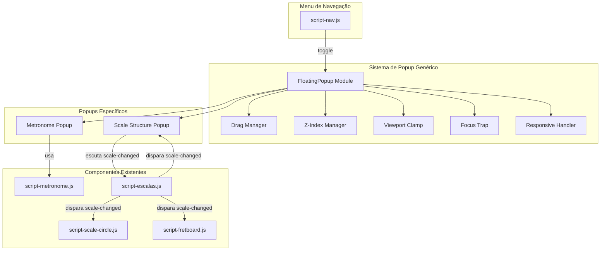

# Design Document: Floating Popups Layout

## Overview

Esta feature implementa um sistema genérico de popups flutuantes para a aplicação MusicPages, transformando os painéis do Metrônomo e da Estrutura de Escalas de seções fixas no fluxo da página para janelas sobrepostas arrastáveis. O sistema é construído inteiramente em vanilla JavaScript/CSS (sem frameworks), mantendo consistência com a arquitetura existente baseada em IIFEs e eventos customizados (`scale-changed`).

A solução consiste em:
- Um módulo genérico `FloatingPopup` que encapsula toda a lógica de drag-and-drop, z-index stacking, viewport clamping, focus trap, acessibilidade e responsividade.
- Instâncias específicas para o Metrônomo e a Estrutura de Escalas que delegam ao sistema genérico.
- Integração com o menu de navegação existente (`script-nav.js`) para toggle dos popups.

## Architecture



### Decisões Arquiteturais

1. **IIFE Pattern**: O módulo FloatingPopup segue o mesmo padrão IIFE usado em `ScaleCircle`, `HeaderNav` e demais módulos da aplicação. Isso garante encapsulamento sem poluir o escopo global.

2. **Event-Driven Sync**: A sincronização entre o popup de Estrutura de Escalas e o seletor de escala usa o evento `scale-changed` já existente, sem acoplamento direto.

3. **CSS Custom Properties**: Os estilos do popup herdam variáveis do tema (claro/escuro) já definidas na aplicação via classes `body.dark`.

4. **Responsive Breakpoint**: Em viewports < 768px (breakpoint já usado em `style-responsive.css`), os popups mudam para modo bottom sheet, desabilitando o drag livre.

5. **Single Script File**: Todo o sistema de popup vive em um único arquivo `script-floating-popup.js`, carregado com `defer` no HTML. Instâncias específicas (metrônomo, escalas) são configuradas dentro do mesmo módulo via factory.

## Components and Interfaces

### FloatingPopup (Módulo Principal)

```javascript
/**
 * Factory que cria instâncias de popup flutuante.
 * @param {Object} config
 * @param {string} config.id - ID único do popup (ex: 'metronome-popup')
 * @param {string} config.title - Título exibido na barra de arraste
 * @param {string} config.contentSelector - Seletor CSS do conteúdo a mover para o popup
 * @param {string} config.menuItemSelector - Seletor do item de menu que abre o popup
 * @param {Object} [config.size] - { width, height } inicial (em px ou %)
 * @param {Function} [config.onOpen] - Callback ao abrir
 * @param {Function} [config.onClose] - Callback ao fechar
 * @returns {PopupInstance}
 */
FloatingPopup.create(config)

/**
 * Interface de uma instância de popup.
 */
interface PopupInstance {
  open(): void;          // Exibe o popup centralizado
  close(): void;         // Oculta o popup
  toggle(): void;        // Alterna visibilidade
  isOpen(): boolean;     // Estado atual
  destroy(): void;       // Remove do DOM e limpa listeners
  getElement(): HTMLElement; // Referência ao elemento DOM raiz
}
```

### DragManager (Sub-módulo interno)

```javascript
/**
 * Calcula a nova posição do popup baseado no delta do movimento.
 * Função pura, testável isoladamente.
 * @param {Object} initialPos - { x, y } posição inicial do popup
 * @param {Object} startPointer - { x, y } posição inicial do ponteiro
 * @param {Object} currentPointer - { x, y } posição atual do ponteiro
 * @returns {Object} { x, y } nova posição do popup
 */
function computeDragPosition(initialPos, startPointer, currentPointer)

/**
 * Restringe a posição do popup para manter pelo menos minVisible px
 * da área de arraste dentro da viewport.
 * Função pura, testável isoladamente.
 * @param {Object} position - { x, y } posição desejada
 * @param {Object} popupSize - { width, height } dimensões do popup
 * @param {Object} viewport - { width, height } dimensões da viewport
 * @param {number} minVisible - px mínimos visíveis (padrão: 32)
 * @returns {Object} { x, y } posição clamped
 */
function clampPosition(position, popupSize, viewport, minVisible)
```

### ZIndexManager (Sub-módulo interno)

```javascript
/**
 * Gerencia z-index entre múltiplos popups.
 * Mantém um contador global e atribui o próximo valor ao popup focado.
 */
const ZIndexManager = {
  BASE_Z: 1000,
  current: 1000,
  bringToFront(popupElement): void, // Incrementa e aplica z-index
  getHighest(): number              // Retorna o z-index mais alto atual
}
```

### ScaleHighlighter (Sub-módulo interno)

```javascript
/**
 * Gerencia o destaque de linha na tabela de estruturas de escalas.
 * @param {HTMLTableElement} tableElement - Referência à tabela
 */
const ScaleHighlighter = {
  currentScale: null,       // tipoEscala armazenado
  highlight(tipoEscala): void,  // Aplica destaque na linha correta
  clear(): void             // Remove qualquer destaque
}
```

### FocusTrap (Sub-módulo interno)

```javascript
/**
 * Implementa focus trap dentro de um container.
 * @param {HTMLElement} container - Elemento que contém os focusable elements
 */
function createFocusTrap(container) {
  return {
    activate(): void,   // Ativa o trap (captura Tab)
    deactivate(): void  // Desativa o trap
  }
}

/**
 * Retorna os elementos focáveis dentro de um container, ordenados por DOM.
 * @param {HTMLElement} container
 * @returns {HTMLElement[]}
 */
function getFocusableElements(container)
```

## Data Models

### PopupState (Estado interno de cada instância)

```javascript
{
  id: string,              // ID único
  isVisible: boolean,      // Estado de visibilidade
  position: { x: number, y: number },  // Posição atual (top-left)
  isDragging: boolean,     // Se está sendo arrastado
  dragStart: { x: number, y: number } | null,  // Posição inicial do ponteiro no drag
  initialPosition: { x: number, y: number } | null,  // Posição do popup ao iniciar drag
  zIndex: number,          // z-index atual
  triggerElement: HTMLElement | null  // Elemento que abriu o popup (para retorno de foco)
}
```

### PopupConfig (Configuração por instância)

```javascript
{
  id: string,
  title: string,
  contentSelector: string,
  menuItemSelector: string,
  size: { width: string, height: string },  // CSS values (ex: '400px', 'auto')
  minVisible: number,     // px mínimos da drag area visíveis (default: 32)
  onOpen: Function | null,
  onClose: Function | null
}
```

### Configurações Específicas

```javascript
// Metronome Popup
{
  id: 'metronome-popup',
  title: 'Metrônomo Digital',
  contentSelector: '#metronomeContainer',
  menuItemSelector: '[data-popup="metronome"]',
  size: { width: '380px', height: 'auto' },
  onClose: () => { /* parar áudio se tocando */ }
}

// Scale Structure Popup
{
  id: 'scale-structure-popup',
  title: 'Estruturas de Escalas',
  contentSelector: '#tabelaGeralEscalasResultado',
  menuItemSelector: '[data-popup="scale-structure"]',
  size: { width: '600px', height: '500px' },
  onOpen: () => { /* aplicar destaque armazenado */ }
}
```

## Correctness Properties

*A property is a characteristic or behavior that should hold true across all valid executions of a system — essentially, a formal statement about what the system should do. Properties serve as the bridge between human-readable specifications and machine-verifiable correctness guarantees.*

### Property 1: Drag position is initial position plus pointer delta

*For any* initial popup position `{x, y}`, any pointer start position `{sx, sy}`, and any current pointer position `{cx, cy}`, the computed drag position SHALL equal `{x + (cx - sx), y + (cy - sy)}`.

**Validates: Requirements 1.3, 7.1**

### Property 2: Viewport clamping keeps drag area visible

*For any* target position, popup size, and viewport dimensions, the clamped position SHALL satisfy: `clampedX + popupWidth >= minVisible` AND `clampedX <= viewportWidth - minVisible` AND `clampedY >= 0` AND `clampedY <= viewportHeight - minVisible`, ensuring at least `minVisible` pixels (32px) of the drag area remain within the viewport boundaries.

**Validates: Requirements 1.5, 1.9**

### Property 3: Last-focused popup has highest z-index

*For any* sequence of focus events across N open popups, the popup that received the most recent focus event SHALL have a `z-index` strictly greater than all other open popups.

**Validates: Requirements 1.8, 4.3**

### Property 4: Scale highlight targets exactly one correct row

*For any* valid `tipoEscala` value (a key present in `estruturasEscalas`), calling the highlight function SHALL result in exactly one table row having the highlight class applied, and that row SHALL correspond to the scale whose name matches the `tipoEscala` key.

**Validates: Requirements 3.3, 3.4, 5.1**

### Property 5: Stored scale is applied on popup open

*For any* valid `tipoEscala` value received via `scale-changed` event while the popup is closed, opening the popup SHALL result in the correct row being highlighted as if the event had been received while open.

**Validates: Requirements 5.3**

### Property 6: Focus trap cycles through all focusable elements

*For any* popup containing N focusable elements (N ≥ 1), pressing Tab while the last focusable element is focused SHALL move focus to the first focusable element, and pressing Shift+Tab while the first focusable element is focused SHALL move focus to the last focusable element.

**Validates: Requirements 6.3**

### Property 7: Non-drag-area interactions don't initiate drag

*For any* interactive element (button, input, select, a) inside the popup that is NOT within the drag area, a mousedown/touchstart event on that element SHALL NOT set the popup into dragging state.

**Validates: Requirements 7.5**

## Error Handling

### Cenários de Erro e Mitigação

| Cenário | Tratamento |
|---------|-----------|
| `contentSelector` não encontra elemento no DOM | Log warning no console, popup não é criado. Não quebra a aplicação. |
| Popup arrastado com viewport = 0 (minimizada) | `clampPosition` usa Math.max para evitar valores negativos inválidos. |
| AudioContext bloqueado pelo browser (autoplay policy) | Já tratado em `script-metronome.js` — o popup não altera esse comportamento. |
| Evento `scale-changed` com `tipoEscala` inexistente | `ScaleHighlighter` remove destaque anterior sem aplicar novo (fail silently). |
| Touch e mouse simultâneos (dispositivos híbridos) | O `DragManager` detecta `pointerdown` via Pointer Events API como padrão, com fallback para mouse/touch events separados se PointerEvent não estiver disponível. |
| Múltiplas instâncias com mesmo ID | Factory rejeita criação e retorna a instância existente (singleton por ID). |
| Popup aberto + resize agressivo | O listener de `resize` é debounced (100ms) e re-aplica `clampPosition`. |

### Degradação Graceful

- Se JavaScript falhar ao carregar o módulo de popup, o conteúdo original permanece inline no fluxo da página (fallback natural).
- Em navegadores sem suporte a `pointer-events` (muito antigos), o fallback usa `mousedown`/`touchstart` separados.

## Testing Strategy

### Abordagem Dual

A estratégia de testes combina:
- **Property-based tests** (fast-check + vitest): Validam propriedades universais das funções puras do sistema.
- **Unit tests** (vitest + jsdom): Validam comportamentos específicos de integração DOM.

### Property-Based Tests

Biblioteca: **fast-check** (já instalada no projeto via `package.json`)
Runtime: **vitest** com ambiente **jsdom**
Mínimo: **100 iterações** por property test

Cada property test deve ser taggeado com:
```
Feature: floating-popups-layout, Property {N}: {description}
```

**Funções puras testáveis por PBT:**
1. `computeDragPosition(initialPos, startPointer, currentPointer)` → Property 1
2. `clampPosition(position, popupSize, viewport, minVisible)` → Property 2
3. `ZIndexManager.bringToFront()` sequências → Property 3
4. `ScaleHighlighter.highlight(tipoEscala)` → Properties 4, 5
5. `FocusTrap` cycling logic → Property 6
6. Drag initiation filtering → Property 7

### Unit Tests (Exemplos e Edge Cases)

- Popup inicia oculto (smoke)
- Toggle de menu abre/fecha popup
- Fechar popup com metrônomo tocando para o áudio
- Atributos ARIA corretos (role, aria-label, aria-modal)
- Body scroll lock quando popup está aberto
- Modo bottom sheet em viewport < 768px
- Multi-touch ignora toques adicionais
- Menu item recebe classe `active` quando popup está aberto
- Foco retorna ao trigger element ao fechar via Escape

### Estrutura de Arquivos de Teste

```
tests/cases/floating-popups-layout/
├── drag-position.property.spec.js      (Property 1)
├── viewport-clamp.property.spec.js     (Property 2)
├── z-index-manager.property.spec.js    (Property 3)
├── scale-highlight.property.spec.js    (Properties 4, 5)
├── focus-trap.property.spec.js         (Property 6)
├── drag-initiation.property.spec.js    (Property 7)
├── popup-lifecycle.unit.spec.js        (smoke + examples)
└── popup-accessibility.unit.spec.js    (ARIA, focus, keyboard)
```
