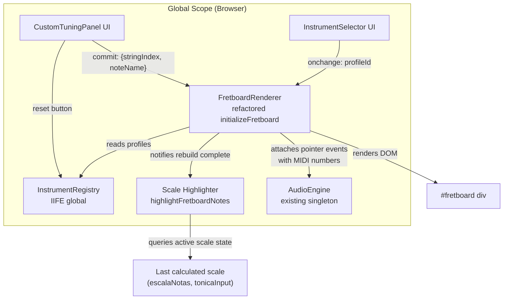
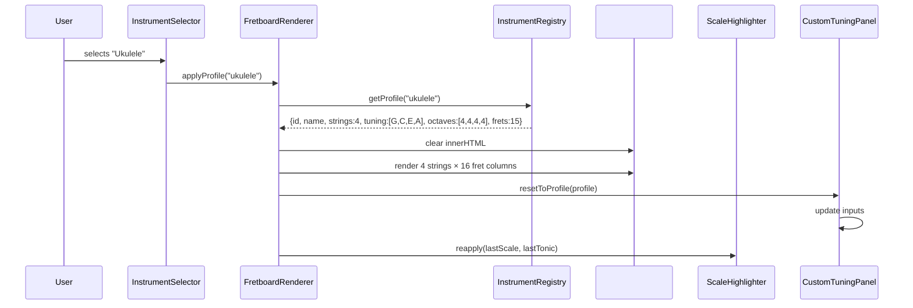

# Design Document: Multi-Instrument Fretboard

## Overview

This design extends the MusicPages fretboard from a hardcoded 6-string guitar to a configurable multi-instrument system. The core change introduces an **Instrument Profile Registry** — a data-driven catalog of stringed instruments — and rewires the fretboard renderer to consume profiles dynamically. A UI selector lets users switch instruments, triggering a full fretboard rebuild with correct tuning, string count, fret count, and MIDI mapping. A custom tuning panel allows per-string overrides.

### Design Decisions

| Decision | Rationale |
|----------|-----------|
| IIFE pattern for new module | Matches existing codebase (no ES6 modules in production); exposes a single global `InstrumentRegistry` |
| Profile data as a plain JS object array | No build step, no JSON fetch needed; data lives in the same script file |
| Fretboard teardown-and-rebuild on instrument change | Simpler than incremental DOM patching; current fretboard already uses this pattern |
| Tuning_Array ordered lowest-to-highest pitch, rendered top-to-bottom reversed | Matches musician's visual perspective (high strings at top) while keeping data model intuitive |
| Single source of truth for active profile state | Avoids drift between UI, renderer, and audio subsystem |
| fast-check for property-based testing | Mature PBT library for JavaScript, integrates natively with Vitest |

## Architecture



### Module Responsibilities

| Module | Responsibility |
|--------|----------------|
| `InstrumentRegistry` | Stores instrument profiles; provides lookup by ID; exposes default profile ID |
| `FretboardRenderer` | Builds/destroys fretboard DOM; calculates note names and MIDI numbers per cell; manages active profile state; exposes public API for rebuild |
| `InstrumentSelector` | Renders `<select>` from registry; dispatches change to renderer |
| `CustomTuningPanel` | Renders per-string inputs; validates note names; dispatches tuning overrides; provides reset |
| `ScaleHighlighter` (existing `highlightFretboardNotes`) | Reapplied after every fretboard mutation; reads last scale state from module-level variable |
| `AudioEngine` (unchanged) | Receives MIDI numbers from pointer events; plays/stops notes |

### Data Flow for Instrument Change



## Components and Interfaces

### InstrumentRegistry (new IIFE global)

```javascript
// Exposed as window.InstrumentRegistry
var InstrumentRegistry = (function() {
    var profiles = [ /* ... profile objects ... */ ];
    var defaultId = 'guitarra-6';

    return {
        /** @returns {InstrumentProfile[]} All registered profiles in order */
        getAll: function() { return profiles.slice(); },

        /** @param {string} id  @returns {InstrumentProfile|null} */
        getById: function(id) { /* ... */ },

        /** @returns {string} The default profile ID */
        getDefaultId: function() { return defaultId; }
    };
})();
```

### FretboardRenderer (refactored from current `initializeFretboard`)

```javascript
// Public API (exposed on window or as globals)
/**
 * Applies a profile by ID: tears down existing fretboard and rebuilds.
 * @param {string} profileId
 * @param {string[]|null} tuningOverride - Optional custom tuning array
 */
function applyInstrumentProfile(profileId, tuningOverride) { /* ... */ }

/**
 * Rebuilds a single string row (used by custom tuning).
 * @param {number} stringIndex
 * @param {string} newNote
 */
function rebuildString(stringIndex, newNote) { /* ... */ }

/**
 * Returns the currently active profile and tuning state.
 * @returns {{ profileId: string, tuning: string[], octaves: number[] }}
 */
function getActiveFretboardState() { /* ... */ }
```

### InstrumentSelector (new)

```javascript
/**
 * Initializes the instrument selector dropdown inside fretboardContainer.
 * Reads profiles from InstrumentRegistry.
 */
function initializeInstrumentSelector() { /* ... */ }
```

### CustomTuningPanel (new)

```javascript
/**
 * Initializes the custom tuning panel with inputs for each string.
 * @param {InstrumentProfile} profile
 */
function initializeCustomTuningPanel(profile) { /* ... */ }

/**
 * Resets all tuning inputs to the profile defaults.
 */
function resetTuningToDefault() { /* ... */ }
```

### Inter-module Communication

All communication uses direct function calls (no event bus). The call chain on instrument change:

1. Selector calls `applyInstrumentProfile(id)`
2. `applyInstrumentProfile` calls `initializeCustomTuningPanel(profile)`
3. After DOM render completes, calls `highlightFretboardNotes(lastScaleNotes, lastTonic)` if a scale is active

## Data Models

### InstrumentProfile

```javascript
/**
 * @typedef {Object} InstrumentProfile
 * @property {string} id           - Unique identifier (1-32 chars, kebab-case)
 * @property {string} name         - Display name (1-64 chars, Portuguese)
 * @property {number} strings      - Number of strings (4-12)
 * @property {string[]} tuning     - Open note names, ordered lowest→highest pitch
 * @property {number[]} octaves    - MIDI octave per string, same order as tuning
 * @property {number} frets        - Number of frets (0-36)
 * @property {boolean} fretless    - Whether instrument is fretless
 */
```

### Registry Data

```javascript
var profiles = [
    {
        id: 'guitarra-6',
        name: 'Guitarra 6 cordas',
        strings: 6,
        tuning: ['E', 'A', 'D', 'G', 'B', 'E'],
        octaves: [2, 2, 3, 3, 3, 4],
        frets: 24,
        fretless: false
    },
    {
        id: 'guitarra-7',
        name: 'Guitarra 7 cordas',
        strings: 7,
        tuning: ['B', 'E', 'A', 'D', 'G', 'B', 'E'],
        octaves: [1, 2, 2, 3, 3, 3, 4],
        frets: 24,
        fretless: false
    },
    {
        id: 'viola-10',
        name: 'Viola 10 cordas',
        strings: 10,
        tuning: ['A', 'A', 'D', 'D', 'G', 'G', 'B', 'B', 'E', 'E'],
        octaves: [2, 3, 3, 4, 3, 4, 3, 3, 4, 4],
        frets: 22,
        fretless: false
    },
    {
        id: 'violao-12',
        name: 'Violão 12 cordas',
        strings: 12,
        tuning: ['E', 'E', 'A', 'A', 'D', 'D', 'G', 'G', 'B', 'B', 'E', 'E'],
        octaves: [2, 3, 2, 3, 3, 4, 3, 4, 3, 3, 4, 4],
        frets: 20,
        fretless: false
    },
    {
        id: 'ukulele',
        name: 'Ukulele',
        strings: 4,
        tuning: ['G', 'C', 'E', 'A'],
        octaves: [4, 4, 4, 4],
        frets: 15,
        fretless: false
    },
    {
        id: 'baixo-4',
        name: 'Baixo 4 cordas',
        strings: 4,
        tuning: ['E', 'A', 'D', 'G'],
        octaves: [1, 1, 2, 2],
        frets: 24,
        fretless: false
    },
    {
        id: 'violao-7',
        name: 'Violão 7 cordas',
        strings: 7,
        tuning: ['B', 'E', 'A', 'D', 'G', 'B', 'E'],
        octaves: [1, 2, 2, 3, 3, 3, 4],
        frets: 19,
        fretless: false
    }
];
```

### ActiveFretboardState (module-level variable)

```javascript
/** @type {{ profileId: string, tuning: string[], octaves: number[] }} */
var _activeFretboardState = {
    profileId: 'guitarra-6',
    tuning: ['E', 'A', 'D', 'G', 'B', 'E'],
    octaves: [2, 2, 3, 3, 3, 4]
};
```

### LastScaleState (module-level variable for highlighting persistence)

```javascript
/** @type {{ scaleNotes: string[]|null, tonic: string|null }} */
var _lastScaleState = { scaleNotes: null, tonic: null };
```

### MIDI Number Calculation

For a given string at index `i` with open note in octave `o` and chromatic index `c`:

```
MIDI = (o + 1) × 12 + c + fretNumber
```

Where `c` = index of the note in `['C','C#','D','D#','E','F','F#','G','G#','A','A#','B']` (0-based).

Example: E2 string, fret 5 → `(2+1)×12 + 4 + 5 = 36 + 4 + 5 = 45` → A2 ✓

### Note Name Calculation

```
noteName = NOTE_NAMES[(chromaticIndex + fretNumber) % 12]
```

### CSS Dynamic Properties

| Instrument Property | CSS Effect |
|---------------------|------------|
| `strings` count | Container height = `strings × 50px` (capped at 600px) |
| `frets` count | Container width = `(frets + 1) × 40px` |
| String index (visual) | `::before` height from 1px (highest pitch) to 4px (lowest pitch), linearly interpolated |

### Responsive Dimension Calculations

```javascript
/**
 * Calculates the fretboard container dimensions for a given profile.
 * @param {InstrumentProfile} profile
 * @returns {{ width: number, height: number, overflow: {x: boolean, y: boolean} }}
 */
function calculateFretboardDimensions(profile) {
    var FRET_WIDTH = 40;   // px per fret cell
    var STRING_HEIGHT = 50; // px per string row
    var MAX_HEIGHT = 600;   // px cap

    var width = (profile.frets + 1) * FRET_WIDTH;
    var rawHeight = profile.strings * STRING_HEIGHT;
    var height = Math.min(rawHeight, MAX_HEIGHT);

    return {
        width: width,
        height: height,
        overflow: {
            x: width > window.innerWidth,
            y: rawHeight > MAX_HEIGHT
        }
    };
}

/**
 * Calculates string thickness for a given visual position.
 * Visual index 0 = top (highest pitch, thinnest), N-1 = bottom (lowest pitch, thickest).
 * @param {number} visualIndex - 0-based index from top
 * @param {number} totalStrings - Total number of strings
 * @returns {number} Thickness in px (1 to 4)
 */
function calculateStringThickness(visualIndex, totalStrings) {
    if (totalStrings <= 1) return 1;
    // Linear interpolation: top=1px, bottom=4px
    return Math.round(1 + (visualIndex / (totalStrings - 1)) * 3);
}
```

### Fret-Zero Sticky Behavior

When horizontal overflow is active, fret-zero (the nut/capotraste column) uses `position: sticky; left: 0;` to remain visible while the user scrolls through higher frets. This provides a constant reference for the open note names.

### Extensibility Considerations

The design accommodates future extensions from NOVASIDEIAS.MD without structural changes:

| Future Feature | Extension Point |
|---------------|-----------------|
| Preset tunings (Half Step Down, etc.) | Add a `presets` array to each InstrumentProfile; CustomTuningPanel gets a preset dropdown |
| Dark mode contrast fixes | Note color CSS variables already isolated in `.color-*` classes; add `[data-theme="dark"] .color-*` overrides |
| Header menu | Independent of fretboard; no architecture impact |
| Visual scale cycle (circle diagrams) | New container; reads same `_lastScaleState` for data |
| Circle of Fifths container | Independent module; can share `getChromaticIndex` and scale helpers |
| Songsterr iframe container | Pure UI addition; no interaction with fretboard logic |

## Correctness Properties

*A property is a characteristic or behavior that should hold true across all valid executions of a system — essentially, a formal statement about what the system should do. Properties serve as the bridge between human-readable specifications and machine-verifiable correctness guarantees.*

### Property 1: Instrument profile schema validity

*For any* InstrumentProfile in the registry, the profile SHALL have: an `id` string of length 1–32, a `name` string of length 1–64, a `strings` integer between 4 and 12 (inclusive), a `tuning` array with exactly `strings` entries each being a valid note name, an `octaves` array with exactly `strings` entries each being an integer 0–8, a `frets` integer between 0 and 36 (inclusive), and a `fretless` boolean.

**Validates: Requirements 1.2**

### Property 2: Instrument selector options match registry

*For any* set of instrument profiles in the registry, the rendered selector dropdown SHALL contain exactly one option per profile, with display text matching each profile's `name` field, in the same order as the registry array.

**Validates: Requirements 2.2**

### Property 3: Fretboard rebuild produces correct string count

*For any* valid InstrumentProfile, after applying that profile to the fretboard renderer, the resulting DOM SHALL contain exactly `profile.strings` string row elements.

**Validates: Requirements 2.3, 3.1, 3.2**

### Property 4: Fretboard rebuild produces correct fret count

*For any* valid InstrumentProfile, after applying that profile, each string row SHALL contain exactly `profile.frets + 1` fret cell elements (representing fret 0 through fret N inclusive).

**Validates: Requirements 3.3**

### Property 5: Note name calculation correctness

*For any* valid chromatic index (0–11) representing an open note and *for any* fret number (0–36), the computed note name SHALL equal `NOTE_NAMES[(chromaticIndex + fretNumber) % 12]`.

**Validates: Requirements 3.4**

### Property 6: MIDI number calculation correctness

*For any* valid octave number (0–8), *for any* valid chromatic index (0–11), and *for any* fret number (0–36), the computed MIDI number SHALL equal `(octave + 1) × 12 + chromaticIndex + fretNumber`.

**Validates: Requirements 3.5, 8.3**

### Property 7: Responsive container dimensions

*For any* valid string count (4–12) and *for any* valid fret count (0–36), the fretboard container width SHALL equal `(frets + 1) × 40` pixels, and the container height SHALL equal `min(strings × 50, 600)` pixels.

**Validates: Requirements 3.6, 3.7, 9.1, 9.2, 9.5**

### Property 8: Visual string ordering is reverse of tuning array

*For any* valid tuning array ordered lowest-to-highest pitch, the fretboard SHALL render strings in reversed order such that the visual row at index 0 (top) displays the last element of the tuning array (highest pitch) and the visual row at index N-1 (bottom) displays the first element (lowest pitch).

**Validates: Requirements 4.1, 4.2, 4.3**

### Property 9: String thickness monotonicity

*For any* string count between 4 and 12, the computed string line thicknesses SHALL form a monotonically non-decreasing sequence from 1px (topmost/highest-pitched string) to 4px (bottommost/lowest-pitched string).

**Validates: Requirements 4.4**

### Property 10: Tuning panel input count and pre-population

*For any* valid InstrumentProfile with N strings, the custom tuning panel SHALL render exactly N input fields, and each input's value SHALL equal the corresponding entry in the profile's tuning array (reversed to match visual order).

**Validates: Requirements 5.1, 5.2**

### Property 11: Note name validation

*For any* input string, the tuning panel SHALL accept it as valid if and only if it matches the pattern: one letter A–G (case-insensitive) optionally followed by exactly one character that is either '#' or 'b', with total length at most 2.

**Validates: Requirements 5.4, 5.5**

### Property 12: Single string rebuild note correctness

*For any* valid note name committed to a string input at index I, the fretboard renderer SHALL recalculate all note cells on string I such that note at fret F equals `NOTE_NAMES[(newNoteChromIndex + F) % 12]`.

**Validates: Requirements 5.3**

### Property 13: Octave preservation on tuning override

*For any* string in the active profile, when the user overrides the open note via the custom tuning panel, the MIDI number calculation for that string SHALL continue using the original octave from the InstrumentProfile (not derive a new octave from the new note name).

**Validates: Requirements 5.7**

### Property 14: Reset restores profile defaults

*For any* InstrumentProfile and *for any* set of custom tuning overrides applied to the fretboard, activating the reset button SHALL restore the tuning array and octave values to exactly match the current profile's original defaults.

**Validates: Requirements 6.2, 6.3**

### Property 15: Scale highlighting persistence across instrument change

*For any* active scale (tonic + scale notes) and *for any* instrument change, after the fretboard rebuild completes, the scale highlighter SHALL apply CSS class "tonic" to all Note_Cells whose note name matches the tonic, and CSS class "in-scale" to all Note_Cells whose note name matches a non-tonic scale note.

**Validates: Requirements 7.1, 7.3, 7.5**

### Property 16: Scale highlighting CSS class correctness

*For any* set of scale notes and a tonic note, and *for any* fretboard configuration, a Note_Cell SHALL have the "tonic" CSS class if and only if its note name matches the tonic (considering enharmonic equivalence), and SHALL have the "in-scale" CSS class if and only if its note name matches a non-tonic note in the scale set.

**Validates: Requirements 7.3**

## Error Handling

### Input Validation Errors

| Error Condition | Handling Strategy |
|----------------|-------------------|
| Invalid note name in tuning input (not matching `[A-Ga-g][#b]?`) | Display red border on the input field; show tooltip "Nota inválida"; do NOT modify fretboard state |
| Empty tuning input on blur | Revert input to previous valid value for that string |
| Profile ID not found in registry | Log warning to console; fall back to default profile (guitarra-6) |

### Runtime Errors

| Error Condition | Handling Strategy |
|----------------|-------------------|
| `#fretboard` container not found in DOM | `applyInstrumentProfile` returns early without error; logs console.warn |
| Web Audio API not supported | `AudioEngine.isSupported()` returns false; pointer events still attached but `playNote`/`stopNote` silently no-op |
| MIDI number out of range (0–127) | Clamp to valid range; notes above MIDI 127 clamp to 127, below 0 clamp to 0 |
| Scale highlighting called with null/empty scale array | Clear all existing highlights; do not apply any new classes |
| Registry is empty (no profiles) | Render an empty fretboard with a message "Nenhum instrumento disponível" |

### Graceful Degradation

- If JavaScript fails to load, the `#fretboard` div remains empty (no broken UI)
- If a profile has `fretless: true`, fret lines are not rendered but note cells still appear at calculated positions
- If viewport is too narrow for even fret-zero column, no special handling (browser scroll handles it)

## Testing Strategy

### Unit Tests (Example-Based)

Unit tests cover specific examples, integration points, edge cases, and non-property-testable requirements:

| Test | Validates |
|------|-----------|
| Default profile is 'guitarra-6' on initialization | Req 1.3 |
| Instrument selector renders inside #fretboardContainer with label | Req 2.1 |
| Selector shows 'guitarra-6' as selected on load | Req 2.4 |
| Reset button is always visible in tuning panel | Req 6.1 |
| No scale active → no highlighting after instrument change | Req 7.4 |
| Highlighting applied after render completes (ordering) | Req 7.5 |
| Pointerdown triggers AudioEngine.playNote with correct MIDI | Req 8.1 |
| Pointerup/cancel/leave triggers AudioEngine.stopNote | Req 8.2 |
| Re-press same cell stops then restarts note | Req 8.4 |
| Missing Web Audio API → no errors thrown | Req 8.5 |
| Horizontal scroll enabled when width > viewport | Req 9.4 |
| Fret-zero stays visible (sticky positioning) | Req 9.4 |
| Duplicate-pitch strings preserve order from tuning array | Req 4.5 |

### Property-Based Tests (fast-check + Vitest)

Each property test runs a minimum of **100 iterations** with random inputs generated by fast-check.

| Property Test | Tag | Iterations |
|---------------|-----|------------|
| Profile schema validity | Feature: multi-instrument-fretboard, Property 1: Instrument profile schema validity | 100 |
| Selector options match registry | Feature: multi-instrument-fretboard, Property 2: Instrument selector options match registry | 100 |
| Rebuild produces correct string count | Feature: multi-instrument-fretboard, Property 3: Fretboard rebuild produces correct string count | 100 |
| Rebuild produces correct fret count | Feature: multi-instrument-fretboard, Property 4: Fretboard rebuild produces correct fret count | 100 |
| Note name calculation | Feature: multi-instrument-fretboard, Property 5: Note name calculation correctness | 100 |
| MIDI number calculation | Feature: multi-instrument-fretboard, Property 6: MIDI number calculation correctness | 100 |
| Responsive dimensions | Feature: multi-instrument-fretboard, Property 7: Responsive container dimensions | 100 |
| Visual string ordering | Feature: multi-instrument-fretboard, Property 8: Visual string ordering is reverse of tuning array | 100 |
| String thickness monotonicity | Feature: multi-instrument-fretboard, Property 9: String thickness monotonicity | 100 |
| Tuning panel inputs match profile | Feature: multi-instrument-fretboard, Property 10: Tuning panel input count and pre-population | 100 |
| Note name validation | Feature: multi-instrument-fretboard, Property 11: Note name validation | 100 |
| Single string rebuild correctness | Feature: multi-instrument-fretboard, Property 12: Single string rebuild note correctness | 100 |
| Octave preservation | Feature: multi-instrument-fretboard, Property 13: Octave preservation on tuning override | 100 |
| Reset restores defaults | Feature: multi-instrument-fretboard, Property 14: Reset restores profile defaults | 100 |
| Scale highlighting persistence | Feature: multi-instrument-fretboard, Property 15: Scale highlighting persistence across instrument change | 100 |
| Scale highlighting CSS correctness | Feature: multi-instrument-fretboard, Property 16: Scale highlighting CSS class correctness | 100 |

### Test Configuration

- **Framework**: Vitest (already configured in project via `vitest.config.js`)
- **PBT Library**: fast-check (integrates natively with Vitest)
- **DOM Mocking**: jsdom or happy-dom (Vitest environment) for DOM-dependent property tests
- **Test Location**: `tests/cases/multi-instrument-fretboard/` directory
- **Naming Convention**: `*.property.spec.js` for PBT tests, `*.unit.spec.js` for example-based tests

### Generator Strategy

Key fast-check generators needed:

```javascript
// Arbitrary valid instrument profile
const arbProfile = fc.record({
    id: fc.string({ minLength: 1, maxLength: 32 }),
    name: fc.string({ minLength: 1, maxLength: 64 }),
    strings: fc.integer({ min: 4, max: 12 }),
    tuning: fc.array(fc.constantFrom('C','C#','D','D#','E','F','F#','G','G#','A','A#','B'), { minLength: 4, maxLength: 12 }),
    octaves: fc.array(fc.integer({ min: 0, max: 8 }), { minLength: 4, maxLength: 12 }),
    frets: fc.integer({ min: 0, max: 36 }),
    fretless: fc.boolean()
}).filter(p => p.tuning.length === p.strings && p.octaves.length === p.strings);

// Arbitrary valid note name
const arbValidNote = fc.constantFrom(
    'C','C#','D','D#','E','F','F#','G','G#','A','A#','B',
    'c','c#','d','d#','e','f','f#','g','g#','a','a#','b',
    'Db','Eb','Gb','Ab','Bb','db','eb','gb','ab','bb'
);

// Arbitrary invalid note name (for validation rejection tests)
const arbInvalidNote = fc.string({ minLength: 0, maxLength: 5 })
    .filter(s => !/^[A-Ga-g][#b]?$/.test(s));

// Arbitrary chromatic index
const arbChromaticIndex = fc.integer({ min: 0, max: 11 });

// Arbitrary fret number
const arbFretNumber = fc.integer({ min: 0, max: 36 });

// Arbitrary octave
const arbOctave = fc.integer({ min: 0, max: 8 });
```

