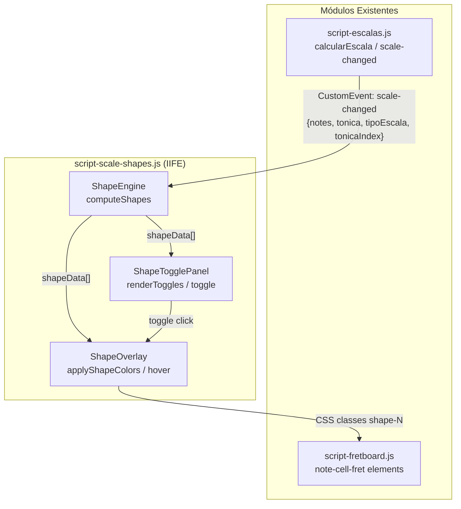

# Design Document: Scale Shapes CAGED

## Overview

Esta feature implementa a visualização de escalas no fretboard segmentada por shapes (método CAGED). O sistema calcula dinamicamente os shapes com base nos intervalos da escala selecionada, segmentando as notas em regiões posicionais do braço. Cada grau da escala serve como nota-raiz de um shape, e a quantidade de shapes é igual ao número de notas da escala (5 para pentatônicas, 7 para diatônicas, etc.).

A solução consiste em:
- **ShapeEngine**: Módulo de cálculo puro que, dado um conjunto de notas de escala e a afinação do instrumento, produz uma estrutura de dados com os shapes (notas agrupadas por posição).
- **ShapeOverlay**: Camada de renderização que aplica cores distintas nas note-cells do fretboard existente.
- **ShapeTogglePanel**: Painel de controle com botões toggle para ligar/desligar shapes individualmente.
- **Interação hover**: Destaque de um shape ao passar o mouse, com esmaecimento dos demais.

## Architecture



### Decisões Arquiteturais

1. **IIFE Pattern**: `script-scale-shapes.js` segue o mesmo padrão dos demais scripts — IIFE que expõe funções globais e `module.exports` condicional para testabilidade com vitest.

2. **Cálculo puro separado de DOM**: O `ShapeEngine.computeShapes()` é uma função pura que recebe dados (notas, afinação, número de trastes) e retorna uma estrutura de dados. Isso permite testes property-based sem DOM.

3. **Overlay aditivo**: O ShapeOverlay adiciona classes CSS (`shape-0`, `shape-1`, ...) às note-cells existentes sem remover classes de cor ou `in-scale`. A prioridade visual é controlada por CSS (especificidade/ordem).

4. **Event-driven**: O módulo escuta exclusivamente o evento `scale-changed` já disparado por `calcularEscala()`. Nenhuma modificação nos módulos existentes é necessária.

5. **CSS dedicado**: Estilos de shape ficam em `style-fretboard.css` (seção dedicada) ou num arquivo separado `style-scale-shapes.css`, com todas as classes prefixadas por `shape-`.

## Components and Interfaces

### ShapeEngine (Cálculo puro)

```javascript
/**
 * Calcula os shapes para uma escala no fretboard.
 * Função PURA — sem dependência de DOM.
 *
 * @param {Object} params
 * @param {string[]} params.scaleNotes - Notas da escala (ex: ['C','D','E','F','G','A','B'])
 * @param {string} params.tonic - Nota tônica
 * @param {string[]} params.tuning - Afinação atual (ex: ['E','A','D','G','B','E'])
 * @param {number} params.numFrets - Número de trastes do instrumento
 * @returns {Shape[]} Array de shapes, um por grau da escala
 */
function computeShapes({ scaleNotes, tonic, tuning, numFrets })

/**
 * Calcula a posição (fret) da primeira ocorrência de uma nota em cada corda.
 * Função auxiliar pura.
 *
 * @param {string} targetNote - Nota alvo (ex: 'G')
 * @param {string[]} tuning - Afinação (ex: ['E','A','D','G','B','E'])
 * @param {number} numFrets - Número de trastes
 * @returns {number[]} Fret de primeira ocorrência por corda (index = string)
 */
function findNotePositions(targetNote, tuning, numFrets)

/**
 * Retorna todas as notas da escala alcançáveis numa faixa de trastes para uma corda.
 * Função auxiliar pura.
 *
 * @param {string} openNote - Nota aberta da corda
 * @param {number} startFret - Primeiro fret da faixa (inclusive)
 * @param {number} endFret - Último fret da faixa (inclusive)
 * @param {string[]} scaleNotes - Notas da escala
 * @param {number} numFrets - Total de frets
 * @returns {NotePosition[]} Notas encontradas com { note, fret, string }
 */
function getScaleNotesInRange(openNote, startFret, endFret, scaleNotes, numFrets)

/**
 * Determina a faixa de trastes (start, end) para um shape dado seu root fret.
 * A faixa é de 4 a 5 trastes, centralizada/iniciando no root.
 *
 * @param {number} rootFret - Fret raiz do shape
 * @param {number} numFrets - Total de frets do instrumento
 * @returns {{ startFret: number, endFret: number }}
 */
function computeShapeRange(rootFret, numFrets)
```

### ShapeOverlay (DOM / Renderização)

```javascript
/**
 * Aplica classes de shape nas note-cells do fretboard.
 * Não remove classes existentes — apenas adiciona.
 *
 * @param {Shape[]} shapes - Array de shapes computados
 */
function applyShapeOverlay(shapes)

/**
 * Remove todas as classes shape-* das note-cells.
 */
function clearShapeOverlay()

/**
 * Retorna a classe CSS de cor para um dado índice de shape.
 * Função pura.
 *
 * @param {number} shapeIndex - Índice do shape (0-based)
 * @returns {string} Nome da classe CSS (ex: 'shape-0', 'shape-1')
 */
function getShapeColorClass(shapeIndex)
```

### ShapeTogglePanel (UI de controle)

```javascript
/**
 * Renderiza o painel de toggles acima do fretboard.
 *
 * @param {number} shapeCount - Número de shapes
 * @param {Function} onToggle - Callback(shapeIndex, isActive) ao clicar
 */
function renderTogglePanel(shapeCount, onToggle)

/**
 * Reseta todos os toggles para o estado ativo.
 */
function resetToggles()

/**
 * Retorna o estado atual de todos os toggles.
 * @returns {boolean[]} Array de estados (true=ativo, false=inativo)
 */
function getToggleStates()
```

### Hover Interaction (DOM events)

```javascript
/**
 * Configura event listeners de hover nas note-cells com shape.
 * - mouseenter: destaca shape do hoveredNote, esmurece os demais
 * - mouseleave: restaura opacidade de todos
 *
 * @param {Shape[]} shapes - Array de shapes computados
 */
function setupHoverInteraction(shapes)

/**
 * Calcula o estado de opacidade para cada shape dado um shape em hover.
 * Função PURA — testável sem DOM.
 *
 * @param {number} hoveredShapeIndex - Índice do shape sob hover (-1 = nenhum)
 * @param {number} totalShapes - Total de shapes
 * @returns {number[]} Array de opacidades (1.0 ou 0.3) por shape index
 */
function computeHoverOpacities(hoveredShapeIndex, totalShapes)
```

## Data Models

### Shape (Estrutura de dados de um shape)

```javascript
/**
 * @typedef {Object} Shape
 * @property {number} index - Índice do shape (0-based)
 * @property {string} rootNote - Nota raiz deste shape (grau da escala)
 * @property {number} rootFret - Fret de referência (posição do rootNote na corda mais grave)
 * @property {number} startFret - Primeiro fret da faixa
 * @property {number} endFret - Último fret da faixa
 * @property {NotePosition[]} notes - Todas as notas pertencentes a este shape
 */

/**
 * @typedef {Object} NotePosition
 * @property {string} note - Nome da nota (ex: 'G')
 * @property {number} fret - Número do traste (0-24)
 * @property {number} string - Índice da corda (0-based, da mais grave para aguda)
 */
```

### ShapeState (Estado do módulo em memória)

```javascript
{
  shapes: Shape[],                // Shapes computados atuais
  toggleStates: boolean[],        // Estado de cada toggle (true=visível)
  hoveredShapeIndex: number,      // Índice do shape sob hover (-1 = nenhum)
  currentScale: {                 // Dados da escala ativa
    notes: string[],
    tonic: string,
    tipoEscala: string,
    tonicaIndex: number
  } | null
}
```

### Paleta de Cores (constante)

```javascript
var SHAPE_COLORS = [
  'shape-0',  // vermelho
  'shape-1',  // azul
  'shape-2',  // verde
  'shape-3',  // laranja
  'shape-4',  // roxo
  'shape-5',  // ciano
  'shape-6',  // magenta
  'shape-7',  // amarelo-escuro
  'shape-8',  // rosa
  'shape-9',  // verde-lima
  'shape-10', // índigo
  'shape-11'  // marrom
];
```

## Error Handling

| Cenário | Tratamento |
|---------|-----------|
| `scale-changed` com `notes` vazio ou undefined | `clearShapeOverlay()` + `resetToggles()` — remove toda visualização |
| Escala com mais notas do que cores na paleta | Reutiliza cores com módulo (`index % SHAPE_COLORS.length`) |
| `tuning` não disponível (fretboard não renderizado) | Log warning, aborta cálculo sem erro |
| Nota de escala não encontrada na faixa de um shape | Shape pode ter 0 notas em certas cordas — comportamento válido |
| Hover em note-cell sem shape (quando alguns shapes estão toggled off) | Ignora hover — não altera opacidades |
| Fretboard re-renderizado (mudança de instrumento) | O próximo `scale-changed` recalcula tudo |
| Scales com 1 nota (teórico) | Produz 1 shape cobrindo o fretboard inteiro — edge case válido |

## Correctness Properties

*A property is a characteristic or behavior that should hold true across all valid executions of a system — essentially, a formal statement about what the system should do. Properties serve as the bridge between human-readable specifications and machine-verifiable correctness guarantees.*

### Property 1: Shape count equals scale note count

*For any* valid scale defined in `estruturasEscalas` and any valid tonic note, `computeShapes()` SHALL produce a number of shapes exactly equal to the number of distinct notes in that scale.

**Validates: Requirements 1.1, 1.5, 1.6, 1.7**

### Property 2: Shape fret span invariant

*For any* computed shape, all notes assigned to that shape SHALL have a fret number within a contiguous range of at most 5 frets (endFret - startFret ≤ 4) from the shape's starting fret position.

**Validates: Requirements 1.3**

### Property 3: Shape union covers all fretboard scale notes

*For any* scale, tonic, and tuning configuration, the union of all notes across all shapes SHALL be exactly equal to the set of all scale notes present on the fretboard — no omissions and no extra notes.

**Validates: Requirements 1.4**

### Property 4: Each shape root is a unique scale degree

*For any* computed set of shapes, the `rootNote` of each shape SHALL be a unique note from the scale, and the set of all shape root notes SHALL equal the complete set of scale notes.

**Validates: Requirements 1.2**

### Property 5: Color class uniqueness per shape

*For any* number of shapes N (where N ≤ palette size), `getShapeColorClass(i)` SHALL return a unique class name for each distinct shape index i in [0, N-1].

**Validates: Requirements 2.1**

### Property 6: Overlay preserves existing CSS classes

*For any* note-cell that already has classes (e.g., `color-C`, `in-scale`, `tonic`), applying the shape overlay SHALL result in the note-cell retaining all original classes in addition to the new `shape-N` class.

**Validates: Requirements 5.3**

### Property 7: Hover opacities — emphasis and dimming

*For any* set of shapes and any shape index S being hovered, `computeHoverOpacities(S, totalShapes)` SHALL return opacity 1.0 for index S and opacity 0.3 for all other indices. When hoveredShapeIndex is -1 (no hover), all opacities SHALL be 1.0.

**Validates: Requirements 3.1, 3.2, 3.3**

### Property 8: Toggle round-trip restores visibility

*For any* shape S that is currently visible, toggling it off (hiding) and then toggling it on again SHALL restore the shape to full visibility, equivalent to its original state.

**Validates: Requirements 4.3, 4.4**

### Property 9: Toggle button color reflects state

*For any* shape S with assigned color class C, when its toggle is active the button background SHALL be C, and when inactive the button background SHALL be the neutral gray color.

**Validates: Requirements 4.5**

### Property 10: Scale change resets all toggles to active

*For any* sequence of two scale-changed events, after the second event fires, all toggle buttons SHALL be in active state and the toggle count SHALL equal the new scale's note count.

**Validates: Requirements 4.6**

### Property 11: Overlapping notes have both shape classes

*For any* note-cell that falls within the fret range of two adjacent shapes, that note-cell SHALL have both shape color classes applied.

**Validates: Requirements 2.4**

## Testing Strategy

### Abordagem Dual

- **Property-based tests** (fast-check + vitest): Validam propriedades universais das funções puras do ShapeEngine e funções de cálculo auxiliares.
- **Unit tests** (vitest + jsdom): Validam comportamentos específicos de integração DOM (overlay, toggle panel, hover).

### Property-Based Tests

Biblioteca: **fast-check** (já instalada)
Runtime: **vitest** com ambiente **jsdom**
Mínimo: **100 iterações** por property test

Tag format: `Feature: scale-shapes-caged, Property {N}: {description}`

**Funções puras testáveis por PBT:**
1. `computeShapes()` → Properties 1, 2, 3, 4
2. `getShapeColorClass()` → Property 5
3. `computeHoverOpacities()` → Property 7
4. `getScaleNotesInRange()` → Auxiliar para Property 3
5. `computeShapeRange()` → Auxiliar para Property 2

### Unit Tests (Exemplos e Edge Cases)

- Paleta tem pelo menos 7 cores distintas (smoke, Req 2.2)
- Todos shapes visíveis após scale-changed (Req 2.3)
- Tonic notes mantêm classe `tonic` após overlay (Req 2.5)
- Transition CSS é 150ms (Req 3.4)
- Toggle panel posicionado acima do fretboard no DOM (Req 4.2)
- ShapeEngine não reage a eventos que não sejam scale-changed (Req 5.1)
- ShapeEngine lê corretamente detail do evento (Req 5.2)
- Overlay limpa tudo quando escala é vazia (Req 5.4)
- Classes de shape usam prefixo "shape-" (Req 5.6)

### Estrutura de Arquivos de Teste

```
tests/cases/scale-shapes-caged/
├── shape-count.property.spec.js              (Property 1)
├── shape-fret-span.property.spec.js          (Property 2)
├── shape-coverage.property.spec.js           (Property 3)
├── shape-root-uniqueness.property.spec.js    (Property 4)
├── shape-color-class.property.spec.js        (Property 5)
├── overlay-preserves-classes.property.spec.js (Property 6)
├── hover-opacities.property.spec.js          (Property 7)
├── toggle-roundtrip.property.spec.js         (Property 8)
├── toggle-color-state.property.spec.js       (Property 9)
├── scale-change-reset.property.spec.js       (Property 10)
├── overlap-both-classes.property.spec.js     (Property 11)
├── shape-engine.unit.spec.js                 (examples + edge cases)
└── shape-overlay.unit.spec.js                (DOM integration)
```
