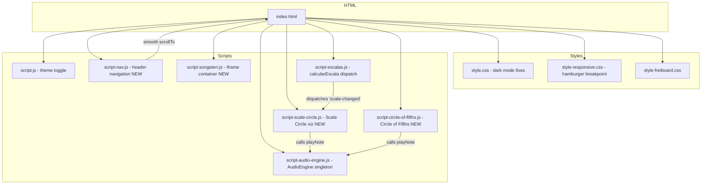

# Design Document: UI Enhancements

## Overview

This design covers five UI enhancements to the MusicPages application: a dark mode contrast fix, a header navigation menu with mobile hamburger, a Scale Circle visualization, a Circle of Fifths interactive diagram, and a Songsterr iframe container. All enhancements integrate with the existing single-page vanilla JavaScript (IIFE pattern) architecture, reuse the global `AudioEngine` singleton for sound playback, and respect the CSS custom property theming system using the `body.dark` class.

### Design Decisions

1. **Pure CSS for dark mode** — All contrast fixes are CSS-only, using the existing `body.dark` selector cascade. No JS changes needed for Requirement 1.
2. **Vanilla JS navigation** — The header menu uses a small IIFE script (`script-nav.js`) with smooth scrolling and a CSS-driven hamburger toggle. No external library needed.
3. **SVG for circular diagrams** — Both the Scale Circle and Circle of Fifths use inline SVG for crisp rendering at any size, accessibility via `<title>` elements, and easy dark mode theming via CSS fill/stroke overrides.
4. **Separation of pure logic from DOM** — Note positioning calculations, scale overlap logic, and URL validation are implemented as pure functions exportable for testing. DOM rendering calls these functions but is not itself property-tested.
5. **Synchronization via event** — A custom `'scale-changed'` event dispatched by `calcularEscala()` allows new components to react without coupling to the existing function.

## Architecture



### Data Flow

1. User changes tonica/tipoEscala → `calcularEscala()` runs → dispatches `CustomEvent('scale-changed', { detail: { notes, tonica, tipoEscala } })` on `document`.
2. `ScaleCircle` listens for `'scale-changed'` and re-renders the SVG polygon.
3. `CircleOfFifths` is static (key layout doesn't change), but highlights the current key when the event fires.
4. Header navigation is purely DOM-driven (anchor links + `scrollIntoView`).
5. Songsterr iframe is self-contained (URL input → validation → iframe load).

## Components and Interfaces

### 1. Dark Mode CSS Enhancements (no new component — CSS only)

Extends the existing `body.dark` selector block in `style.css` and `style-fretboard.css` to cover all containers, form elements, tables, and newly added sections.

### 2. HeaderNav (script-nav.js)

```javascript
/**
 * HeaderNav IIFE
 * Creates and manages the navigation menu and hamburger toggle.
 */
var HeaderNav = (function () {
  function init() { /* builds DOM, attaches listeners */ }
  function scrollToSection(sectionId) { /* smooth scroll */ }
  function toggleMobileMenu() { /* open/close hamburger */ }
  function closeMobileMenu() { /* close after link click */ }
  return { init: init };
})();
```

**DOM structure produced:**
```html
<nav id="headerNav" class="header-nav" aria-label="Navegação principal">
  <button class="hamburger-btn" aria-expanded="false" aria-controls="navLinks">☰</button>
  <ul id="navLinks" class="nav-links">
    <li><a href="#metronomeContainer">Metrônomo</a></li>
    <li><a href="#scaleCalcSection">Calculadora de Escalas</a></li>
    <li><a href="#tecladoVirtualContainer">Teclado Virtual</a></li>
    <li><a href="#fretboardContainer">Braço do Instrumento</a></li>
    <li><a href="#scaleCircleContainer">Círculo de Escalas</a></li>
    <li><a href="#circleOfFifthsContainer">Ciclo de Quintas</a></li>
    <li><a href="#songsterrContainer">Songsterr</a></li>
  </ul>
</nav>
```

### 3. ScaleCircle (script-scale-circle.js)

```javascript
/**
 * ScaleCircle IIFE
 * Renders a circular SVG visualization of 12 chromatic notes
 * with scale polygon overlay and compare mode.
 */
var ScaleCircle = (function () {
  // Pure functions (testable)
  function computeNotePositions(centerX, centerY, radius, startAngle) { /* returns [{x, y, note}] */ }
  function computeScalePolygon(notePositions, scaleNotes) { /* returns SVG points string */ }
  function computeOverlap(scaleA, scaleB) { /* returns { shared, onlyA, onlyB } */ }

  // DOM functions
  function init(containerId) { /* builds SVG, listens for 'scale-changed' */ }
  function render(scaleNotes, compareNotes) { /* updates SVG elements */ }
  function enableCompareMode() { /* shows secondary selectors */ }
  function handleNoteClick(noteName) { /* calls AudioEngine.playNote */ }

  return {
    init: init,
    computeNotePositions: computeNotePositions,
    computeScalePolygon: computeScalePolygon,
    computeOverlap: computeOverlap
  };
})();
```

### 4. CircleOfFifths (script-circle-of-fifths.js)

```javascript
/**
 * CircleOfFifths IIFE
 * Renders an interactive SVG Circle of Fifths diagram.
 */
var CircleOfFifths = (function () {
  // Pure data
  var MAJOR_KEYS = ['C','G','D','A','E','B','F#','Db','Ab','Eb','Bb','F'];
  var MINOR_KEYS = ['Am','Em','Bm','F#m','C#m','G#m','Ebm','Bbm','Fm','Cm','Gm','Dm'];
  var KEY_SIGNATURES = { 'C': 0, 'G': 1, 'D': 2, /* ... */ };

  // Pure functions (testable)
  function getSegmentAngle(index, total) { /* returns { startAngle, endAngle } */ }
  function getKeySignatureInfo(keyName) { /* returns { count, type: 'sharps'|'flats' } */ }
  function getRelativeMinor(majorKey) { /* returns minor key name */ }
  function isEnharmonicPosition(index) { /* returns boolean */ }

  // DOM functions
  function init(containerId) { /* builds SVG rings */ }
  function handleSegmentClick(keyName, isMajor) { /* highlight + play + show info */ }

  return {
    init: init,
    getSegmentAngle: getSegmentAngle,
    getKeySignatureInfo: getKeySignatureInfo,
    getRelativeMinor: getRelativeMinor,
    isEnharmonicPosition: isEnharmonicPosition,
    MAJOR_KEYS: MAJOR_KEYS,
    MINOR_KEYS: MINOR_KEYS
  };
})();
```

### 5. SongsterrEmbed (script-songsterr.js)

```javascript
/**
 * SongsterrEmbed IIFE
 * Manages the Songsterr iframe container with URL validation.
 */
var SongsterrEmbed = (function () {
  var URL_PATTERN = /^https:\/\/www\.songsterr\.com\/a\/wsa\/.+/;

  // Pure function (testable)
  function validateSongsterrUrl(url) { /* returns { valid: boolean, error?: string } */ }

  // DOM functions
  function init(containerId) { /* builds input, button, iframe area */ }
  function loadUrl(url) { /* validates and sets iframe src */ }
  function clear() { /* removes iframe, resets input */ }

  return {
    init: init,
    validateSongsterrUrl: validateSongsterrUrl,
    URL_PATTERN: URL_PATTERN
  };
})();
```

## Data Models

### Scale Change Event Detail

```javascript
// CustomEvent dispatched by calcularEscala()
{
  type: 'scale-changed',
  detail: {
    notes: ['C', 'D', 'E', 'F', 'G', 'A', 'B'],  // Array of note names in scale
    tonica: 'C',                                      // Root note
    tipoEscala: 'maior',                             // Scale type key
    tonicaIndex: 0                                   // Chromatic index 0-11
  }
}
```

### Note Position (Scale Circle)

```javascript
{
  note: 'C',       // Note name
  index: 0,        // Chromatic index (0-11)
  x: 200,          // SVG x coordinate
  y: 50,           // SVG y coordinate
  angle: -90       // Degrees from 3 o'clock (C at top = -90°)
}
```

### Key Signature Info (Circle of Fifths)

```javascript
{
  key: 'D',
  type: 'sharps',    // 'sharps' | 'flats' | 'none'
  count: 2,          // Number of sharps/flats
  notes: ['F#', 'C#'] // The actual altered notes
}
```

### Songsterr Validation Result

```javascript
{
  valid: true,       // Whether URL is acceptable
  error: null        // Error message string, or null if valid
}
```

### Scale Overlap Result (Compare Mode)

```javascript
{
  shared: ['C', 'D', 'E', 'G', 'A'],  // Notes in both scales
  onlyA: ['F', 'B'],                    // Notes only in scale A
  onlyB: ['F#', 'B']                    // Notes only in scale B (empty if no compare)
}
```

